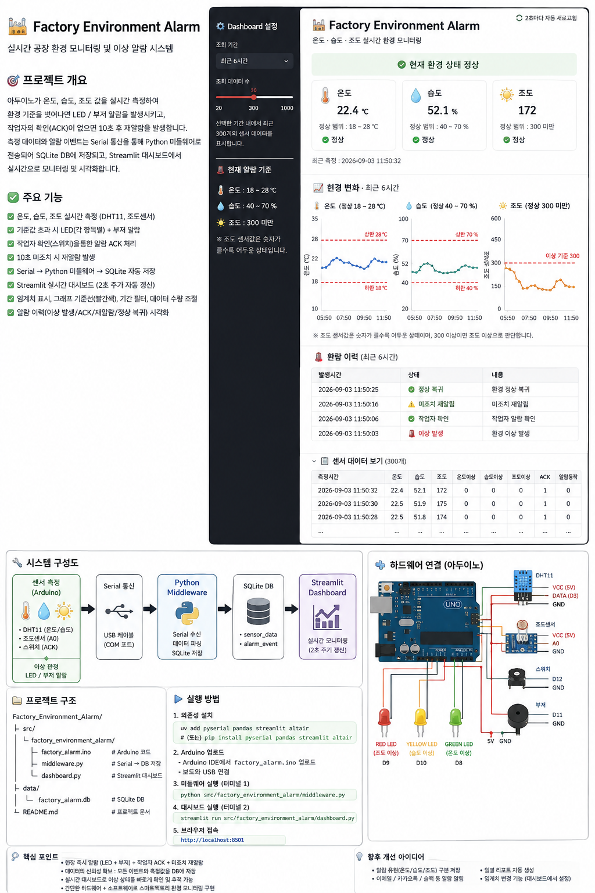

# 🏭 Factory Environment Alarm



Arduino 센서와 Python · SQLite · Streamlit을 연동한 **공장 환경 이상 감지 및 재알람 모니터링 시스템**입니다.

온도·습도·조도를 실시간으로 측정하고, 설정된 정상 범위를 벗어나면 Arduino에서 LED와 부저 알람을 발생시킵니다. 
작업자가 스위치를 눌러 알람을 확인(ACK)할 수 있으며, ACK 이후에도 이상 상태가 계속 유지되면 재알람을 발생시킵니다.

센서 데이터와 알람 이벤트는 USB Serial 통신을 통해 Python Middleware로 전달되고, SQLite DB에 저장된 뒤 Streamlit Dashboard에서 실시간으로 조회·시각화됩니다.

---

## 🎯 Project Goal

단순 센서 출력이 아니라 다음 흐름을 구현하는 것을 목표로 했습니다.

```text
이상 감지
   ↓
현장 LED / Buzzer 알람
   ↓
작업자 ACK
   ↓
환경 상태 계속 감시
   ↓
미조치 시 재알람
   ↓
정상 복귀
   ↓
이력 저장 및 Dashboard 모니터링
```

---

## 🧩 System Architecture

```text
DHT11 / Light Sensor
        ↓
      Arduino
        ↓
LED · Buzzer · Switch
        ↓
     USB Serial
        ↓
 Python Middleware
        ↓
      SQLite
        ↓
Streamlit Dashboard
```

### Arduino
- 온도·습도·조도 측정
- 이상 기준 판정
- LED / Buzzer 현장 알람
- Switch ACK 처리
- 미조치 재알람
- Serial 데이터 전송

### Python Middleware
- Serial 데이터 수신
- `DATA` / `EVENT` 메시지 파싱
- SQLite 저장

### Streamlit Dashboard
- 현재 센서값 표시
- 정상 / 이상 상태 표시
- Threshold 기준선 표시
- 센서 Trend 그래프
- 알람 Event 이력 조회
- 조회 기간 및 데이터 수 조절

---

## ✅ Main Features

- DHT11 기반 온도·습도 측정
- 조도 센서 기반 밝기 측정
- 센서별 임계치 이상 판정
- 온도 / 습도 / 조도별 LED 구분 표시
- 최초 알람 / 재알람 부저 패턴 구분
- 작업자 Switch ACK
- ACK 후 이상 상태 지속 시 재알람
- Arduino → USB Serial → Python 데이터 전달
- SQLite 센서 데이터 및 이벤트 저장
- Streamlit 실시간 Dashboard
- 2초 주기 Dashboard 자동 갱신
- 최근 1시간 / 6시간 / 24시간 / 전체 기간 조회
- 표시 데이터 개수 Slider 조절
- 그래프 상·하한 Red Threshold Line 표시

---

## 🚨 Alarm Threshold

| 항목 | 정상 범위 | 이상 조건 |
|---|---:|---:|
| 🌡️ 온도 | 18 ~ 28 ℃ | 18 ℃ 미만 또는 28 ℃ 초과 |
| 💧 습도 | 40 ~ 70 % | 40 % 미만 또는 70 % 초과 |
| ☀️ 조도 | 300 미만 | 300 이상 |

조도 센서 실측값:

```text
휴대폰 Flash   약 84
실내 평상시    약 170
센서 가림      약 450
```

현재 회로에서는 **센서값이 커질수록 어두운 상태**로 판단합니다.

---

## 🔌 Hardware Pin Mapping

| Component | Arduino Pin | 역할 |
|---|---|---|
| Switch | D12 | 작업자 ACK |
| DHT11 | D3 | 온도·습도 측정 |
| Buzzer | D11 | 현장 알람 |
| Red LED | D9 | 조도 이상 |
| Yellow LED | D10 | 습도 이상 |
| Green LED | D8 | 온도 이상 |
| Light Sensor | A0 | 조도 측정 |

---

## 🔔 Alarm Logic

### 최초 이상 발생

```text
센서 이상
   ↓
해당 LED ON
   ↓
삐 - 삐 - 삐
```

### 작업자 ACK

```text
Switch 입력
   ↓
ACK 처리
   ↓
LED / Buzzer OFF
   ↓
센서 상태 계속 감시
```

### 미조치 재알람

현재 테스트 버전에서는 ACK 후 **10초** 동안 이상 상태가 유지되면 재알람합니다.

```text
ACK
 ↓
10초 동안 이상 지속
 ↓
삐삐삐삐삐삐
```

---

## 📡 Serial Protocol

### Sensor DATA

```text
DATA,temperature,humidity,light,temp_alarm,hum_alarm,light_alarm,acknowledged,alert_active
```

정상 데이터 예:

```text
DATA,22.40,52.00,171,0,0,0,0,0
```

### Alarm EVENT

```text
EVENT,ALARM_START
EVENT,ACK
EVENT,RE_ALERT
EVENT,NORMAL
```

| Event | 의미 |
|---|---|
| `ALARM_START` | 환경 이상 최초 발생 |
| `ACK` | 작업자 알람 확인 |
| `RE_ALERT` | 미조치 재알람 |
| `NORMAL` | 환경 정상 복귀 |

---

## 🗄️ Database

### `sensor_data`

```text
measured_at
temperature
humidity
light
temp_alarm
hum_alarm
light_alarm
acknowledged
alert_active
```

### `alarm_event`

```text
event_at
event_type
message
```

실행 중 생성되는 `*.db` 파일은 Git 관리 대상에서 제외하고, `schema.sql`과 `init_db.py`를 이용해 로컬에서 다시 생성할 수 있도록 구성했습니다.

---

## 📁 Project Structure

```text
Factory-Environment-Alarm-260903/
│
├── arduino/
│   └── factory_alarm/
│       └── factory_alarm.ino
│
├── src/
│   └── factory_environment_alarm/
│       ├── __init__.py
│       ├── init_db.py
│       ├── middleware.py
│       └── dashboard.py
│
├── data/
│   └── factory_alarm.db       # Runtime 생성 / Git 제외
│
├── schema.sql
├── pyproject.toml
├── uv.lock
├── .gitignore
└── README.md
```

---

## 🛠 Tech Stack

### Hardware
- Arduino UNO R4 Minima
- DHT11
- Light Sensor
- LED
- Buzzer
- Push Switch
- Breadboard

### Software
- Arduino C/C++
- Python
- PySerial
- SQLite
- pandas
- Altair
- Streamlit

---

## ▶️ How to Run

### 1. Clone

```bash
git clone https://github.com/chodaseul/Factory-Environment-Alarm-260903.git
cd Factory-Environment-Alarm-260903
```

### 2. Install Dependencies

```bash
uv sync
```

또는:

```bash
pip install pyserial pandas streamlit altair
```

### 3. Initialize Database

```bash
python src/factory_environment_alarm/init_db.py
```

### 4. Upload Arduino Code

Arduino IDE에서 다음 파일을 업로드합니다.

```text
arduino/factory_alarm/factory_alarm.ino
```

Serial Baud Rate:

```text
115200
```

### 5. Run Middleware

> Middleware 실행 전 Arduino IDE의 **Serial Monitor를 닫아야 합니다.** 동일한 COM Port를 Serial Monitor와 Python이 동시에 사용할 수 없습니다.

```bash
python src/factory_environment_alarm/middleware.py
```

### 6. Run Dashboard

```bash
python -m streamlit run src/factory_environment_alarm/dashboard.py
```

기본 접속 주소:

```text
http://localhost:8501
```

---

## 💡 Key Implementation Points

### 1. 현장 알람과 모니터링 역할 분리
Arduino는 센서 판단과 현장 알람을 담당하고, Python은 데이터 수집·저장·시각화를 담당합니다.

### 2. ACK는 정상 복귀가 아님
작업자가 Switch를 눌러 ACK하더라도 센서 이상 상태는 계속 감시합니다. 실제 환경이 정상으로 돌아오지 않으면 일정 시간 후 재알람합니다.

### 3. 센서 데이터와 이벤트 데이터 분리
연속 측정값은 `sensor_data`, 상태 변화는 `alarm_event`에 저장하여 Trend 분석과 Alarm History를 각각 조회할 수 있도록 구성했습니다.

---

## 📌 Current Scope

교육 및 PoC 목적의 Mini Factory Environment Monitoring System입니다.

현재 구현 범위:
- 실시간 환경 측정
- Threshold 기반 이상 판단
- 센서별 LED 표시
- Buzzer 현장 알람
- 작업자 ACK
- 미조치 재알람
- Serial Middleware
- SQLite 저장
- Streamlit Dashboard
- Alarm History

---

## 👩‍💻 Author

**chodaseul**  
AI Smart Manufacturing Training Project · 2026
